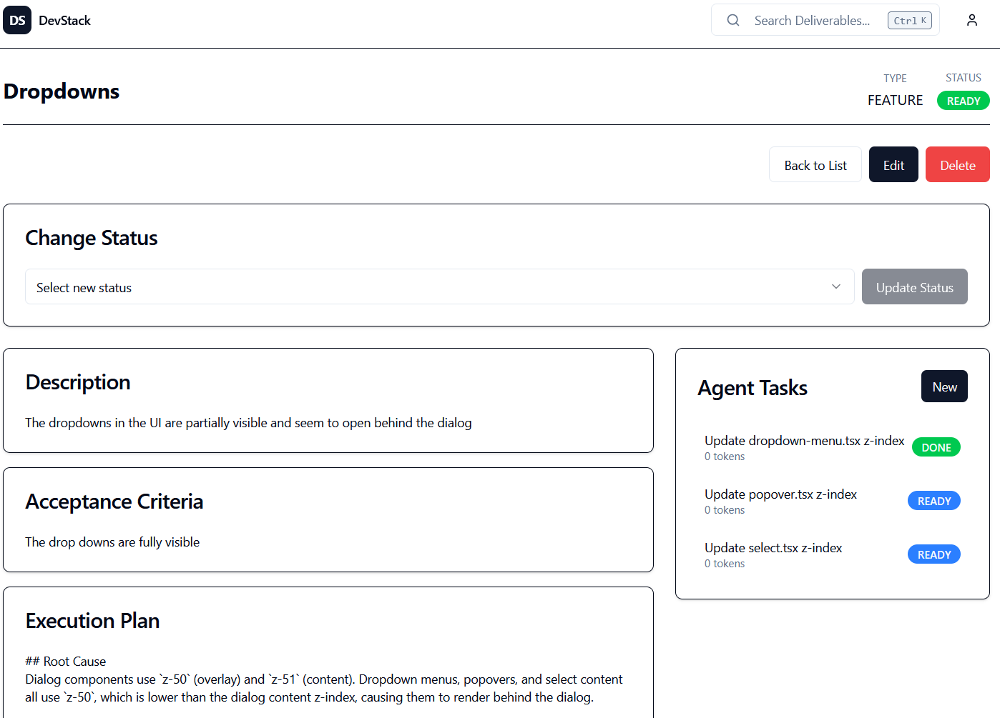
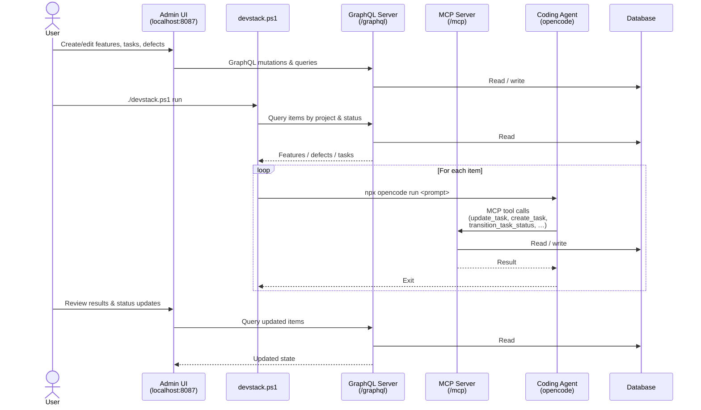

# devstack

When I started experimenting with local LLMs for coding, I quickly discovered that they are very slow andnot very capable. You may have a free resource but actually using that resource requires different patterns. Having gone thought a few coding projects,
I realized I needed a framework to analyze requirements, break them down into scoped work items that can be performed by a local LLM, and to run this in a loop until all the work is done. It also needs to have a library of prompts on hand to perform a variety of tasks.

And, to be fair, a vibe coding project to do more vibe coding? What could go wrong?

If you are bored of my musings, head over to the [instructions](wwwroot/HOWTO.md).
If you are intested in the progress so far, there is a [history](wwwroot/HISTORY.md)

# Key learnings

- Spec is everything. It is very easy to generate a lot of code from a detailed spec. It is much harder to make changes to existing code. At times it may be easier to revise the spec and to throw away the code. Invest in spec engineering.
- Prompts are everything. AI is not intelligent and there is no intrinsic motivation. You don't (usually) have to ask a software engineer to write tests. Don't take anything for granted for AI work. It sometimes will but if you want to be sure provide instructions.
- AI likes to succeed at all cost. It will delete code that is considered problematic or completely ignore specific instructions.
- If the semantics of the library that the AI is using have changed, the AI will assume it knows what to do but it will be several versions behind and it may take a long time to recover. That's the most frequent hallucination I have seen.
- It's not your tech stack anymore. It's the AI's tech stack. Pick the one it can code in.

# Dream

You enter features, requirements and the occasional bug report, the automation does the rest!

# Stack

The project can't build itself unfortunately (maybe it will be able to improve itself). My coding agent is opencode and I have the following tools installed to help with the coding
- saga: The closest I could find to meet my requirements. Models epics, stories and tasks internally.  On the initially planning pass, gpt-5.4 generated more than a hundred tasks to execute. (saga-mcp)
- codebase-memory: Indexes the codebase and also has an architecture tool call
- context7: Code samples for many use cases
- dotnet: Dotnet sdk for solutions, projects, test runs and nuget (Community.Mcp.DotNet)
- fetch: web fetch (mcp-server-fetch)
- filesystem: better access to local files (@modelcontextprotocol/server-filesystem)
- git: naturally (mcp-server-git)
- refactor: bulk edits, not sure how to get opencode to use this more (@myuon/refactor-mcp@latest)

# Coding flow

# Models

I think there are a couple of useful tiers to be considered

- A top of the line model (I like GPT 5.4) to do the planning
- A midrange model to do higher complexity work, hopefully at 10% of the cost (I like MiniMax 2.7)
- A larger local LLM. Quen3 coder next seems to be a reasonable compromise between speed, capability and stability. I wanted to try gemma 4 but it crashes every 5 minutes under llama.cpp.
- I am not sure if there is an edge model that can run coding tasks and tool calls. So far it has been discouraging. Hopefully eventually a model can be found to run on 8 or 16gb VRAM.

The core planning prompt is to split the work into tasks that can be performed by an AI coding agent in under 20 minutes, to be specific about what is to be accomplished, and to rate the complexity.

# References and inspriration
- [Prompt Kit](https://github.com/microsoft/PromptKit)
- [Spec Kit](https://github.com/github/spec-kit)
- [Awesome Copilot](https://github.com/github/awesome-copilot)
- [Awesome Copilot](https://github.com/github/awesome-copilot)
- [Agent Skills For Real Engineers](https://github.com/mattpocock/skills)
