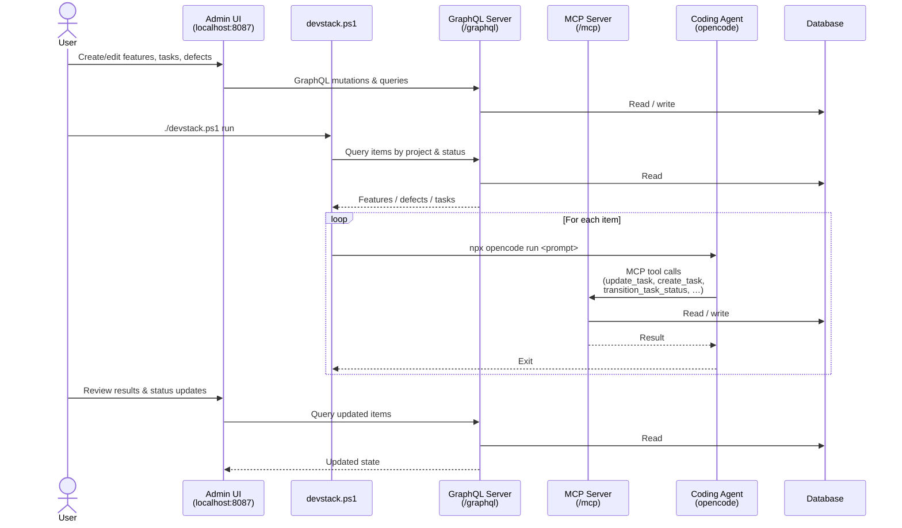

# devstack progression

## Initial motivation

When I started experimenting with local LLMs for coding, I quickly discovered that they are very slow and not very capable. You may have a free resource but actually using that resource requires different patterns. Having gone through a few coding projects,
I realized I needed a framework to analyze requirements, break them down into scoped work items that can be performed by a local LLM, and to run this in a loop until all the work is done. It also needs to have a library of prompts on hand to perform a variety of tasks.

And, to be fair, a vibe coding project to do more vibe coding? What could go wrong?

If you are bored of my musings, head over to the [instructions](HOWTO.md).
If you are interested in the progress so far, there is a [history](HISTORY.md)

# Key learnings

- Spec is everything. It is very easy to generate a lot of code from a detailed spec. It is much harder to make changes to existing code. At times it may be easier to revise the spec and to throw away the code. Invest in spec engineering.
- Prompts are everything. AI is not intelligent and there is no intrinsic motivation. You don't (usually) have to ask a software engineer to write tests. Don't take anything for granted for AI work. It sometimes will but if you want to be sure provide instructions.
- AI likes to succeed at all cost. It will delete code that is considered problematic or completely ignore specific instructions.
- If the semantics of the library that the AI is using have changed, the AI will assume it knows what to do but it will be several versions behind and it may take a long time to recover. That's the most frequent hallucination I have seen.
- It's not your tech stack anymore. It's the AI's tech stack. Pick the one it can code in.

# Dream


You enter features, requirements and the occasional bug report, the automation does the rest!

# Stack

The project can't build itself unfortunately (maybe it will be able to improve itself). My coding agent is OpenCode and I have the following tools installed to help with the coding
- Saga: The closest I could find to meet my requirements. Models epics, stories and tasks internally.  On the initially planning pass, GPT-4o generated more than a hundred tasks to execute. (saga-mcp)
- codebase-memory: Indexes the codebase and also has an architecture tool call
- context7: Code samples for many use cases
- dotnet: Dotnet sdk for solutions, projects, test runs and nuget (Community.Mcp.DotNet)
- fetch: web fetch (mcp-server-fetch)
- filesystem: better access to local files (@modelcontextprotocol/server-filesystem)
- git: naturally (mcp-server-git)
- refactor: bulk edits, not sure how to get OpenCode to use this more (@myuon/refactor-mcp@latest)

# Coding flow



# Models

I think there are a couple of useful tiers to be considered

- A top of the line model (I like GPT 5.4) to do the planning
- A midrange model to do higher complexity work, hopefully at 10% of the cost (I like MiniMax 2.7)
- A larger local LLM. Quen3 coder next seems to be a reasonable compromise between speed, capability and stability. I wanted to try gemma 4 but it crashes every 5 minutes under llama.cpp.
- I am not sure if there is an edge model that can run coding tasks and tool calls. So far it has been discouraging. Hopefully eventually a model can be found to run on 8 or 16gb VRAM.

The core planning prompt is to split the work into tasks that can be performed by an AI coding agent in under 20 minutes, to be specific about what is to be accomplished, and to rate the complexity of the task.


# Iteration 4 reflection

The project has some structural deficiencies related to using coding agents
- The Hot Chocolate (graphQL) library is implemented as a code-first approach. That's great for getting results quickly, however there is no schema.graphql for clients to consume directly
- The Hot Chocolate online documentation mixes schema-first and code first and isn't really machine readable
- I failed to convince AI to deal with Strawberry Shake (a C# code generator) because it can't find the generated code (it's generated during the build process behind the scenes)
- AI could not deal with tests executing against a locally deployed instance and it could not figure out testcontainers without some serious intervention
- There is no GraphQL standard for filtering, sorting or paging.
- The Hot Chocolate [UseFiltering] and [UsePaging] attributes are terribly convenient for developers, no meat on the bones for AI
- The models I have at my disposal aren't particularly adept at writing Powershell, and I haven't gotten over my dislike for Python.
- I made a lot of changes to the schema over time

These factors combined have made it really time-consuming and error prone to keep integration tests, the MCP server, the runner, the admin UI and the admin UI tests up to date. I tried to produce a schema.graphql derived from the Hot Chocolate implementation but then that was not fully correct and any errors propagate through the system quickly. I also procured an alternative implementation on node.js/apollo which I thought would be a better fit for a schema-first approach, however I haven't had a chance to test that.

I have the MCP server use the DbContext for writes and the commands for writes to avoid graphql entanglements, but ideally the MCP server would be it's own unit.

Plan: I haven't decided on the best path forward for the API surface. I'll make one more attempt at anchoring the client code around a single ```schema.graphql```.

- Opencode (on Windows) is run via npm/npx and that itself is a batch file. There seem to be a lot of complication capturing and/or displaying the output
- I'd like to run Opencode with user prompts off (so it doesn't get stuck) and bash off (to limit the damage potential a little bit) however there is no commandline option to do so. Ironically there is a commandline option to disable all the protections. The runner could write these permissions into the local ```opencode.json``` but then that would hamper interactive development.

Plan: There are a couple of options for coding agents that have an API (including Opencode). Need to investigate and compare.

- There is a feature gap where I had planned to run tasks one by one, and how I manage git branches. I initially thought to create a branch, then run all the agent task, then run the pull request job. However that's a nontrivial state machine and it makes cleanup of failed operations difficult. Coding tasks are expected to fail and will also be frequently rejected if there are open questions.

I think there is wisdom in SpecKit's approach to try and front load a lot of planning and implementation decisions to then one-shot the entire implementation.

Plan: Rewrite the execution step for the coding agent to enumerate and execute the tasks on it's own. This has worked well even with the 'lesser' models I run locally.

# Iteration 3

When I started this out, I might have assumed we are writing code for human consumption and modification, and I modeled a human-centric, incremental workflow. That's not wrong, but also not entirely right. In a greenfield project, the specification is the the source of truth, the code is disposable, and if the code is not correct, we need to revise the specification until we get the intended results.

I ran such prompts for a night, and it has seen some success. The agent made incremental changes that closed gaps between the specification and the implementation. I had substantially revised and simplified the data model and made the user interface specification more clear, so that was a good test. However, the code agent considers the entire source code as the truth, and it's been difficult to get it to just implement the specification. At some point it found a stale schema.graphql with the tests and proceeded to change the server to match that schema (despite the instructions to consider the spec the source of truth). Furthermore, no prompt has been successful to get it to write verifiably correct, tested code.

Qwen/Qwen3.6-35B-A3B has been a real delight. It runs at twice the speed of Qwen/Qwen3.5-122B-A10B with comparable results.

The "Please make the code so it matches the spec" approach is very token intensive. I go through 250m prompt and 1m generated tokens a day. For now I brought the codebase memory mcp back, maybe that will speed up the analysis stage. My head is full of ideas for a better workflow but I also want to reach a stage where the project is fully functional. 

# V1

Qwen3.5-122B-A10B declared it production ready after completing the initial 100 tasks that came out of ```SPEC.md```. There were a couple of initial issues
- Agent code had a few typescript issues. That was avoidable
- There was a runtime error with BullMQ related to the redis configuration. That's pretty understandable, only discoverable at runtime
- CORS needed to be configured for graphql to be accessible from a browser
- An environment variable was set to point the admin UI to the graphql endpoint, but browser code can't use environment variables. Fair.
- There is another issue with BullMQ that I need to look into
- There is an issue with GraphQL "Unable to infer or resolve the type of field Feature.validStatusTransitions.". Definitely should have asked for live integration tests.

The implementation comes with a fair bit of complexity. There is a full work queue system for the coding agent, react lazy loading, a dead letter queue ... 

A variety of "open questions" documents were created, as well as a top level package.json (?)

# Pivot

As it turns out, it wasn't really working. The Admin UI was built on a ```schema.graphql``` that it hand created, instead of the actual schema it should have retrieved from the server. React/Apollo has really tight coupling between the generated classes and the code, so most of it was just wrong.

I also realized there was no need to invent another coding agent. That is not a unique value add. I experimented a little more with how I run opencode, and I will likely discontinue the coding agent. The design was pivoted for the graphql server to also be an _MCP Server_ to facilitate interaction with a coding agent.

The saga MCP server continues to be very valuable. It does not have an UI or a feedback loop to restart tasks that have open questions.

"4. Removed broken test project - The DevStack.Tests.Integration.GraphQL.Client project had fundamental design issues: it mixed domain types (DevStack.Domain.Enums) with StrawberryShake-generated types. This caused 25 compilation errors that couldn't be easily fixed without rewriting all the tests. Removed the entire project rather than try to fix it."

Right - can we build some accountability into these models :)

